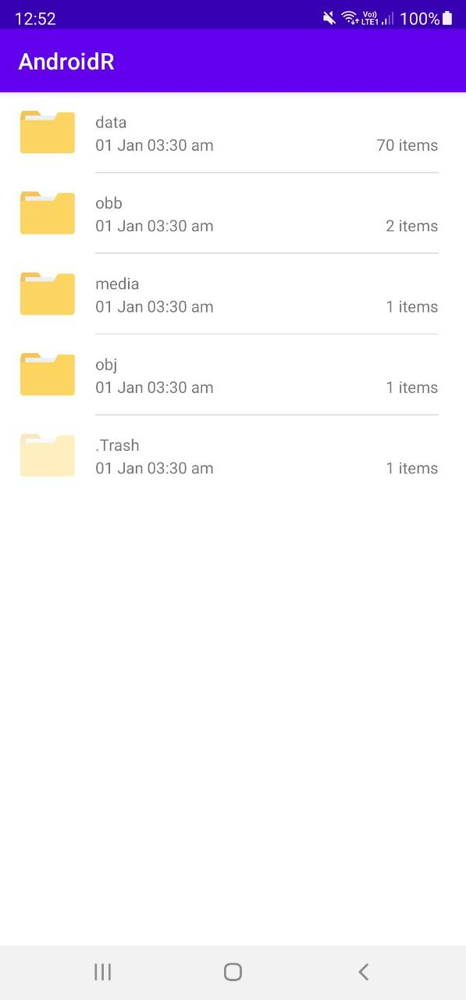
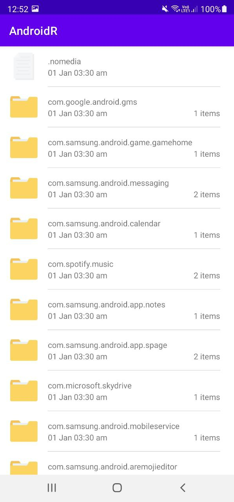

# AndroidDirectoryAccess
 

Simple app to get Android/{data,obb} directory access for Android >= 11 without root. (Supports all versions of Android)

This is useful for File Managers on Android >= 11.

[-] Tested on Samsung Note20 Ultra (Android 11).
